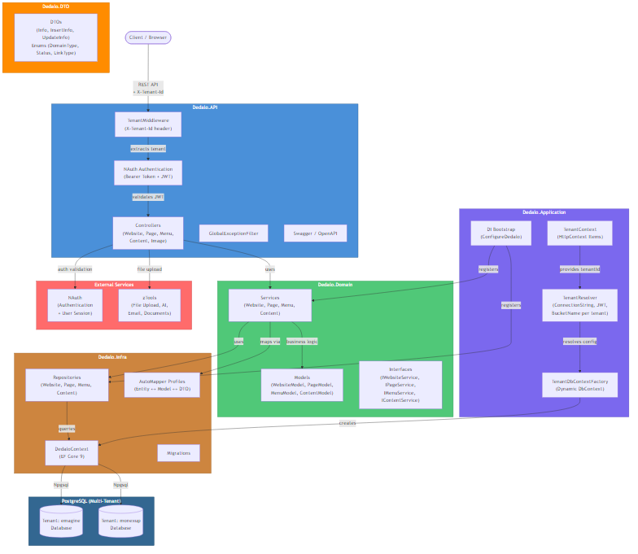

# Dedalo - Multi-Tenant CMS Platform


## Overview

**Dedalo** is a multi-tenant Content Management System (CMS) backend API built with **.NET 8** and **Clean Architecture**. It provides RESTful endpoints for managing websites, pages, menus, and content blocks with per-tenant database isolation, ownership-based authorization, and file upload capabilities.

---

## 🚀 Features

- 🏢 **Multi-Tenant Architecture** - Per-tenant database isolation with dynamic connection resolution via `X-Tenant-Id` header
- 🌐 **Website Management** - Create and manage websites with custom domains, subdomains, or folder-based routing
- 📄 **Page Builder** - Dynamic page creation with slug-based public access
- 📝 **Content Blocks** - Flexible content system with type, ordering, and area-based batch operations
- 🗂️ **Menu Hierarchy** - Self-referencing menu items with parent-child relationships
- 🖼️ **Image Upload** - File upload via zTools integration with per-tenant bucket isolation
- 🔐 **NAuth Authentication** - Bearer token auth with per-tenant JWT secrets
- 🔓 **Public & Private APIs** - Anonymous endpoints for website rendering, authenticated endpoints for management
- 📋 **Swagger Documentation** - Interactive API docs in development/docker environments

---

## 🛠️ Technologies Used

### Core Framework
- **.NET 8** - Backend API runtime
- **ASP.NET Core** - Web framework with middleware pipeline

### Database
- **PostgreSQL 17** - Primary database (multi-tenant)
- **Entity Framework Core 9** - ORM with lazy loading proxies
- **Npgsql** - PostgreSQL provider for EF Core

### Security
- **NAuth** - Authentication package with per-tenant JWT secret support

### Additional Libraries
- **AutoMapper** - Object-to-object mapping (Entity ↔ Model ↔ DTO)
- **Serilog** - Structured logging with console output
- **zTools** - File upload (S3), AI (ChatGPT), email, document validation

### Testing
- **xUnit** - Test framework
- **Moq** - Mocking library
- **coverlet** - Code coverage collection

### DevOps
- **Docker** - Containerized deployment with `docker-compose`
- **GitHub Actions** - CI/CD pipeline for production deployment via SSH

---

## 📁 Project Structure

```
Dedalo/
├── Dedalo.API/                  # ASP.NET Core entry point
│   ├── Controllers/             # REST controllers (Website, Page, Menu, Content, Image)
│   ├── Filters/                 # GlobalExceptionFilter
│   ├── Middlewares/             # TenantMiddleware
│   ├── Dockerfile               # Container build configuration
│   └── Startup.cs               # HTTP pipeline, Swagger, CORS, Auth
├── Dedalo.Application/          # Dependency injection & tenant resolution
│   ├── Startup.cs               # ConfigureDedalo() — all DI registrations
│   ├── TenantResolver.cs        # Resolves tenant config from appsettings
│   ├── TenantDbContextFactory.cs # Creates DbContext per tenant
│   └── NAuthTenant*.cs          # NAuth tenant integration
├── Dedalo.Domain/               # Business logic layer
│   ├── Models/                  # Rich domain models (WebsiteModel, PageModel, etc.)
│   ├── Services/                # Business services with ownership validation
│   └── Interfaces/              # Service + infrastructure contracts
├── Dedalo.DTO/                  # Data transfer objects (zero dependencies)
│   ├── Website/                 # WebsiteInfo, InsertInfo, UpdateInfo, Enums
│   ├── Page/                    # PageInfo, PagePublicInfo, InsertInfo, UpdateInfo
│   ├── Menu/                    # MenuInfo, InsertInfo, UpdateInfo, LinkTypeEnum
│   └── Content/                 # ContentInfo, InsertInfo, UpdateInfo, ContentAreaInfo
├── Dedalo.Infra.Interfaces/     # Generic repository interfaces
│   └── Repository/              # IWebsiteRepository<T>, IPageRepository<T>, etc.
├── Dedalo.Infra/                # Infrastructure implementation
│   ├── Context/                 # DedaloContext + EF entity POCOs
│   ├── Repository/              # Repository implementations
│   ├── Mappers/                 # AutoMapper profiles
│   └── Migrations/              # EF Core migrations
├── Dedalo.Tests/                # Unit tests
│   └── Domain/
│       ├── Services/            # Service tests with Moq
│       └── Mappers/             # AutoMapper profile validation tests
├── docker-compose.yml           # Dev: API + PostgreSQL
├── docker-compose-prod.yml      # Prod: API only (external DB)
└── .github/workflows/           # GitHub Actions deploy pipeline
```

---

## 🏗️ System Design

The following diagram illustrates the high-level architecture of **Dedalo**:



The request flow follows: Client sends REST request with `X-Tenant-Id` header → `TenantMiddleware` extracts tenant → NAuth validates JWT with tenant-specific secret → Controller delegates to Domain Service → Service validates ownership and uses Repository → Repository maps via AutoMapper and queries tenant-specific database via EF Core.

> 📄 **Source:** The editable Mermaid source is available at [`docs/system-design.mmd`](docs/system-design.mmd).

---

## ⚙️ Environment Configuration

### 1. Copy the environment template

```bash
cp .env.example .env
```

### 2. Edit the `.env` file

```bash
# Database
POSTGRES_USER=postgres
POSTGRES_PASSWORD=your_secure_password_here
POSTGRES_DB=dedalo

# Tenant: emagine (default)
EMAGINE_CONNECTION_STRING=Host=db;Port=5432;Database=dedalo;Username=postgres;Password=your_secure_password_here
EMAGINE_JWT_SECRET=your_jwt_secret_min_32_chars_here

# Tenant: monexup
MONEXUP_CONNECTION_STRING=Host=db;Port=5432;Database=dedalo;Username=postgres;Password=your_secure_password_here
MONEXUP_JWT_SECRET=your_jwt_secret_min_32_chars_here

# Dedalo
DEDALO_BUCKET_NAME=dedalo

# NAuth
NAUTH_API_URL=https://your-nauth-url/auth-api
NAUTH_BUCKET_NAME=nauth

# zTools
ZTOOLS_API_URL=https://your-ztools-url/tools-api

# App
APP_PORT=5000
```

⚠️ **IMPORTANT**:
- Never commit the `.env` file with real credentials
- Only the `.env.example` should be version controlled
- Change all default passwords and secrets before deployment

---

## 🐳 Docker Setup

### Quick Start with Docker Compose

#### 1. Prerequisites

```bash
docker network create emagine-network
```

#### 2. Build and Start Services

```bash
docker-compose up -d --build
```

#### 3. Verify Deployment

```bash
docker-compose ps
docker-compose logs -f
```

### Accessing the Application

| Service | URL |
|---------|-----|
| **Dedalo API** | http://localhost:5000 |
| **Swagger UI** | http://localhost:5000/swagger/ui |
| **Health Check** | http://localhost:5000/ |
| **PostgreSQL** | localhost:5432 |

### Docker Compose Commands

| Action | Command |
|--------|---------|
| Start services | `docker-compose up -d` |
| Start with rebuild | `docker-compose up -d --build` |
| Stop services | `docker-compose stop` |
| View status | `docker-compose ps` |
| View logs | `docker-compose logs -f` |
| Remove containers | `docker-compose down` |
| Remove containers and volumes (⚠️) | `docker-compose down -v` |

---

## 🔧 Manual Setup (Without Docker)

### Prerequisites
- .NET 8 SDK
- PostgreSQL 17

### Setup Steps

#### 1. Restore dependencies

```bash
dotnet restore Dedalo.sln
```

#### 2. Configure appsettings

Edit `Dedalo.API/appsettings.Development.json` with your database connection and tenant configuration.

#### 3. Apply migrations

```bash
dotnet ef database update --project Dedalo.Infra --startup-project Dedalo.API
```

#### 4. Run the API

```bash
dotnet run --project Dedalo.API
```

The API will be available at `https://localhost:44374`.

---

## 🧪 Testing

### Running Tests

**All Tests:**
```bash
dotnet test Dedalo.Tests/Dedalo.Tests.csproj
```

**Single Test:**
```bash
dotnet test Dedalo.Tests/Dedalo.Tests.csproj --filter "FullyQualifiedName~WebsiteServiceTests.GetByIdAsync_ReturnsModel"
```

**Test Class:**
```bash
dotnet test Dedalo.Tests/Dedalo.Tests.csproj --filter "FullyQualifiedName~ContentServiceTests"
```

### Test Structure

```
Dedalo.Tests/
├── Domain/
│   ├── Services/        # WebsiteServiceTests, PageServiceTests, MenuServiceTests, ContentServiceTests
│   └── Mappers/         # WebsiteProfileTests, PageProfileTests, MenuProfileTests, ContentProfileTests
```

---

## 📚 API Documentation

### Authentication

All authenticated endpoints require:
```
Authorization: Bearer <token>
X-Tenant-Id: <tenant-id>
```

### Key Endpoints

#### Website (`/website`)

| Method | Endpoint | Description | Auth |
|--------|----------|-------------|------|
| GET | `/website` | List user's websites | Yes |
| GET | `/website/{id}` | Get website by ID | Yes |
| GET | `/website/slug/{slug}` | Get website by slug | No |
| GET | `/website/domain/{domain}` | Get website by custom domain | No |
| POST | `/website` | Create website | Yes |
| PUT | `/website/{id}` | Update website | Yes |
| DELETE | `/website/{id}` | Delete website | Yes |

#### Page (`/website/{websiteId}/page`)

| Method | Endpoint | Description | Auth |
|--------|----------|-------------|------|
| GET | `/website/{websiteId}/page` | List pages | Yes |
| GET | `/website/{websiteId}/page/{id}` | Get page by ID | Yes |
| GET | `/page/{pageSlug}?websiteSlug=x` | Get page with contents (grouped by slug) | No |
| GET | `/page/{pageSlug}?domain=x` | Get page with contents (by domain) | No |
| POST | `/website/{websiteId}/page` | Create page | Yes |
| PUT | `/website/{websiteId}/page/{id}` | Update page | Yes |
| DELETE | `/website/{websiteId}/page/{id}` | Delete page | Yes |

#### Menu (`/website/{websiteId}/menu`)

| Method | Endpoint | Description | Auth |
|--------|----------|-------------|------|
| GET | `/website/{websiteId}/menu` | List menus | Yes |
| GET | `/website/{websiteId}/menu/{id}` | Get menu by ID | Yes |
| GET | `/menu?websiteSlug=x` | List menus publicly | No |
| GET | `/menu?domain=x` | List menus by domain | No |
| POST | `/website/{websiteId}/menu` | Create menu | Yes |
| PUT | `/website/{websiteId}/menu/{id}` | Update menu | Yes |
| DELETE | `/website/{websiteId}/menu/{id}` | Delete menu | Yes |

#### Content (`/website/{websiteId}/page/{pageId}/content`)

| Method | Endpoint | Description | Auth |
|--------|----------|-------------|------|
| GET | `/website/{wId}/page/{pId}/content` | List contents | Yes |
| GET | `/website/{wId}/page/{pId}/content/{id}` | Get content by ID | Yes |
| GET | `/content/{pageSlug}?websiteSlug=x` | List contents publicly | No |
| POST | `/website/{wId}/page/{pId}/content` | Create content | Yes |
| PUT | `/website/{wId}/page/{pId}/content/{id}` | Update content | Yes |
| PUT | `/website/{wId}/page/{pId}/content/area` | Save content area (batch) | Yes |
| DELETE | `/website/{wId}/page/{pId}/content/{id}` | Delete content | Yes |

#### Image (`/image`)

| Method | Endpoint | Description | Auth |
|--------|----------|-------------|------|
| POST | `/image/upload` | Upload image (100MB limit) | Yes |
| POST | `/image/upload/logo/{websiteId}` | Upload website logo | Yes |

---

## 💾 Backup and Restore

### Backup

```bash
docker-compose exec db pg_dump -U postgres dedalo > backup_$(date +%Y%m%d).sql
```

### Restore

```bash
docker-compose exec -T db psql -U postgres dedalo < backup_20260329.sql
```

---

## 🚀 Deployment

### Production Environment

Production deployment is automated via GitHub Actions (`.github/workflows/deploy-prod.yml`):

1. Push to `main` branch triggers the pipeline
2. Repository is cloned/updated on the production server via SSH
3. Secrets are injected into `.env.prod`
4. Docker network is ensured
5. Services are rebuilt and started with `docker-compose-prod.yml`

### Manual Production Deploy

```bash
cp .env.prod.example .env.prod
# Edit .env.prod with production values
docker-compose --env-file .env.prod -f docker-compose-prod.yml up --build -d
```

---

## 🔄 CI/CD

### GitHub Actions

**Workflow:** `deploy-prod.yml`

**Triggers:**
- Push to `main` branch
- Manual dispatch (`workflow_dispatch`)

**Jobs (sequential):**
1. `checkout` — Clone/update repository on server
2. `inject-secrets` — Write `.env.prod` from GitHub Secrets
3. `network-setup` — Ensure Docker network exists
4. `stop-services` — Stop running containers
5. `build-deploy` — Build and start services

---

## 👨‍💻 Author

Developed by **[Rodrigo Landim Carneiro](https://github.com/nickolaslondim)**

---

## 📄 License

This project is licensed under the **MIT License** - see the [LICENSE](LICENSE) file for details.

---

## 📞 Support

- **Issues**: [GitHub Issues](https://github.com/emaginebr/Dedalo/issues)

---

**⭐ If you find this project useful, please consider giving it a star!**
